# Excel_Dashboard_Step

# **Step 1: Explanation for Excel Dashboard**

**First of all let’s get Functions for the Dashboard like this:**

1. **Dashboard Purpose**
2. **Data Source**
3. **Each chart or KPI meaning**
4. **Key insights or conclusions** 
5. **slicers & Formulas**

# **Step 2: Take Screenshots for the Dashboard**

<aside>
💡

**This is my Dashboard for SalesData.**

</aside>

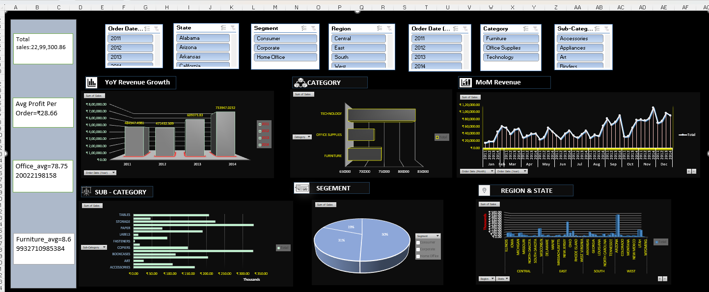

<aside>
💡

 **This is my Pivort_Chart & Pivort_Table.**

</aside>

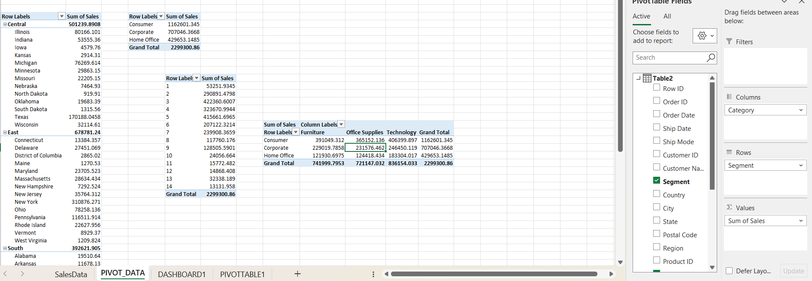

<aside>
💡

**And the last This is my SalesData, There are thousands row in this Data.**

</aside>

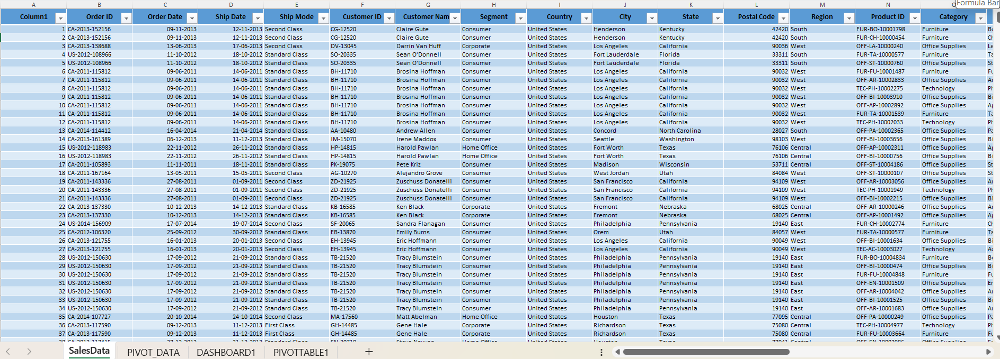

# **Step 3. Combine Text + Screenshots**

[📊 **Dashboard Overview :**](https://www.notion.so/Dashboard-Overview-28c546669c7e8024a26bdee3dfd3f9c6?pvs=21)

<aside>
💡

 **1. This is Dashboard for SalesData, It’s provides an company sales performance by Region and State by Sales, Sub-category by Sales, Category by Sales, YoY Revenue by Sales, MoM Revenue by Sales, Segement by Sales.** 

</aside>

[**🔲  Region & State by sales  :**](https://www.notion.so/Region-State-by-sales-28c546669c7e8010b56ace44e042016a?pvs=21)

<aside>
💡

**This chart compares Total revenue across all Regions & State, In this I can easily see the State & Region prices also.** 

</aside>

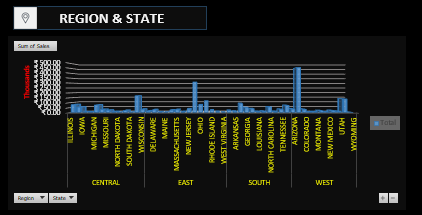

<aside>
💡

**This is the chart of  Pivort Table where I have kept Sales by Region & State**.

</aside>

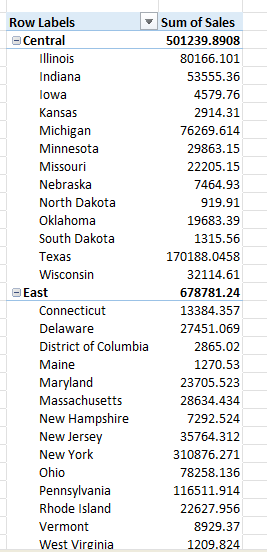

[**📝 YoY Revenue Growth :**](https://www.notion.so/YoY-Revenue-Growth-28c546669c7e80c0892dd7e651fc5b06?pvs=21)

<aside>
💡

**In this chart, I combined Order Date and Sales, Where I can  easily calculate the total Sales based on the Order Date.**

</aside>

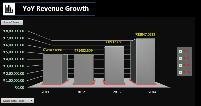

<aside>
💡

**This is my Pivort Table, In Which I put the Order Date and Sales together in the Pivort Table.**

</aside>

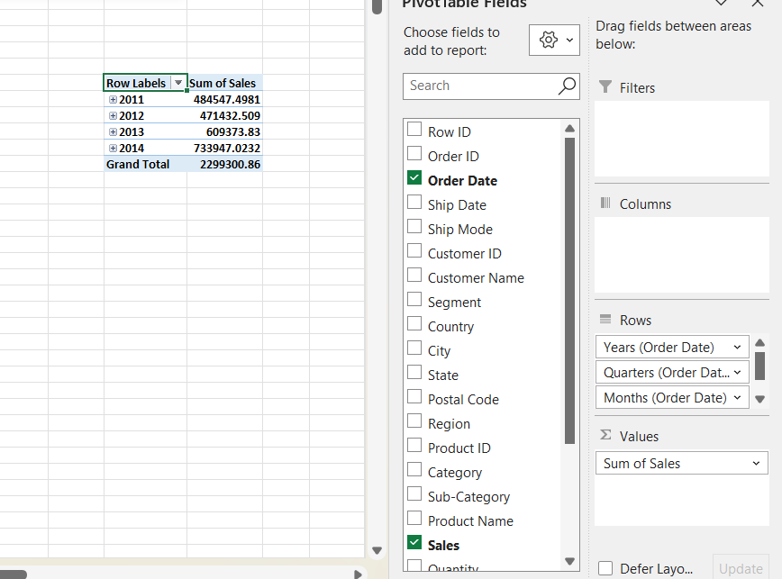

[⚙️ Category  :](https://www.notion.so/Category-28c546669c7e80a1a065ffad3f0acfa0?pvs=21)

<aside>
💡

**This is the chart, I combined Sales by Category, Where I can easily see the Price and Product.**

</aside>

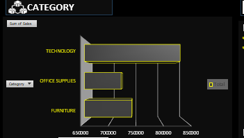

<aside>
💡

**This is the chart of Pivort Table, where I have arranged Sales by Categor**

</aside>

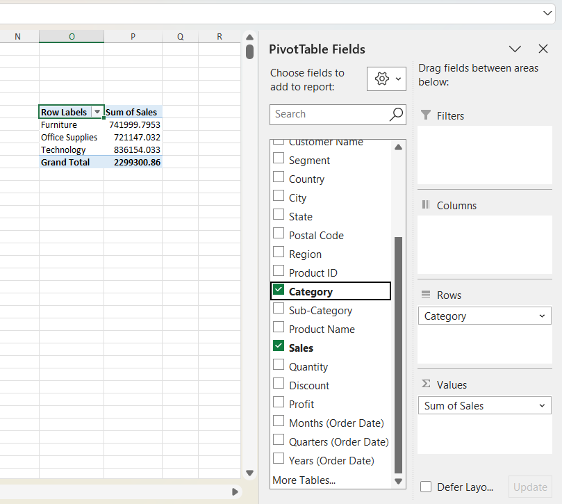

[**📈 MoM Revenue :**](https://www.notion.so/MoM-Revenue-28c546669c7e80f98542fa69cd04fed3?pvs=21)

<aside>
💡

**This is the Table where I plotted Sales by Order Date ( Year ) & Order Date ( Month ).** 

</aside>

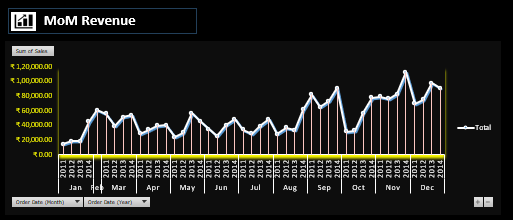

<aside>
💡

**This is Chart of Pivort Table, Where I combined Sales by Order Date ( Year ) & Order Date ( Month).**

</aside>

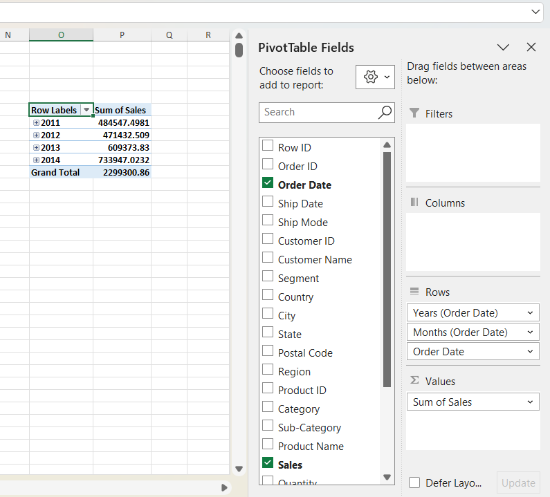

[**☢️ Segement :**](https://www.notion.so/Segement-28c546669c7e806b83acfeb9cf881e49?pvs=21)

<aside>
💡

**Here I have kept Sales by Segement so that I can see the Total Sales in each Segement in percentage**.

</aside>

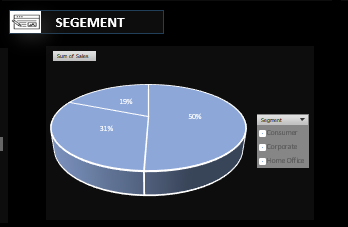

<aside>
💡

**PivortTable chart: Where I just put the Data like above, In this I put together Sales by Segement**.

</aside>

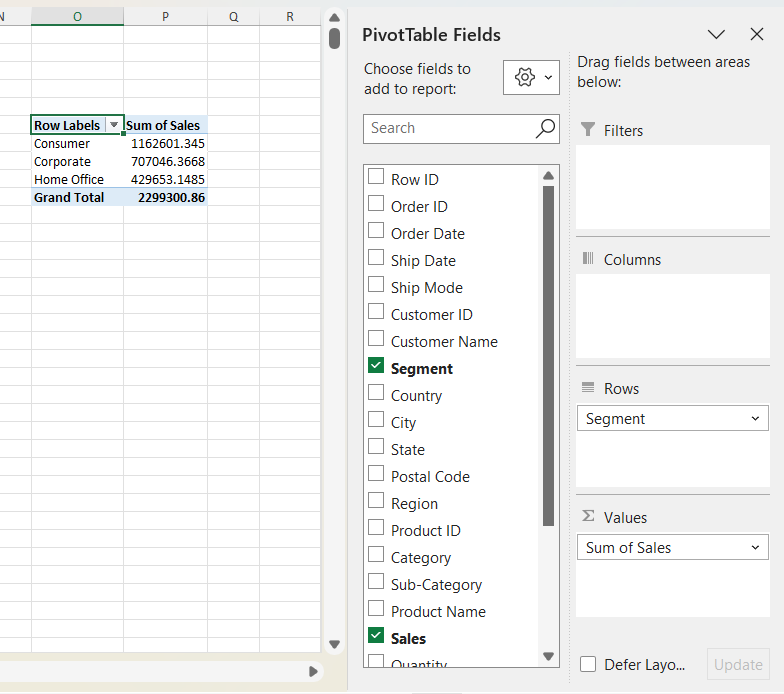

[**🪧 Sub- Category :**](https://www.notion.so/Sub-Category-28c546669c7e8084a6bff6ed65f50132?pvs=21)

<aside>
💡

**This is the chart, Where I found that the Sales by Sub-Category I see price easily calculated which can be seen very clearly.** 

</aside>

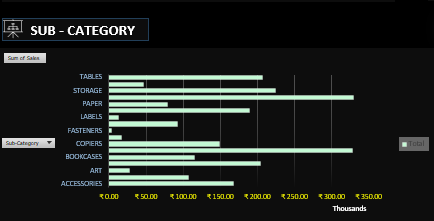

<aside>
💡

**And finally, I took the Pivort Table, Where I put together Sales by Sub-Category**.

</aside>

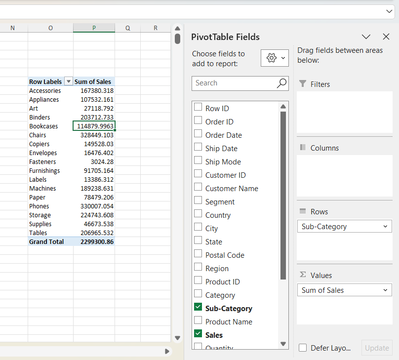

[**🕰️ Slicer :**](https://www.notion.so/Slicer-28c546669c7e8075947acf3660a48870?pvs=21)

<aside>
💡

**These are Slicers, Which are connected to their own DataTable I mean their own charts, through which I found out that even every small Data can be easily found.**

</aside>

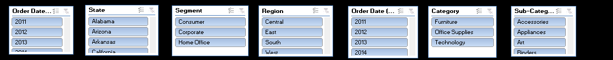

<aside>
💡

**This is chart of Pivort Table, Where I combined Sales by State who is connected his Table.**

</aside>

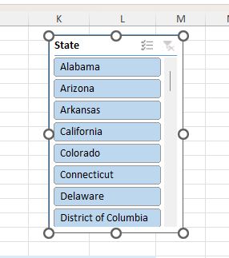

[**📝 Calculation & Formulas :**](https://www.notion.so/Calculation-Formulas-28c546669c7e80358b98f96c74e81b64?pvs=21)

<aside>
💡

**These are some Formulas with the help of which I can easily find the Sum or Average of any other values.** 

</aside>

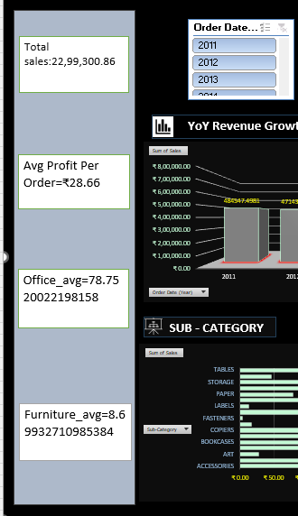